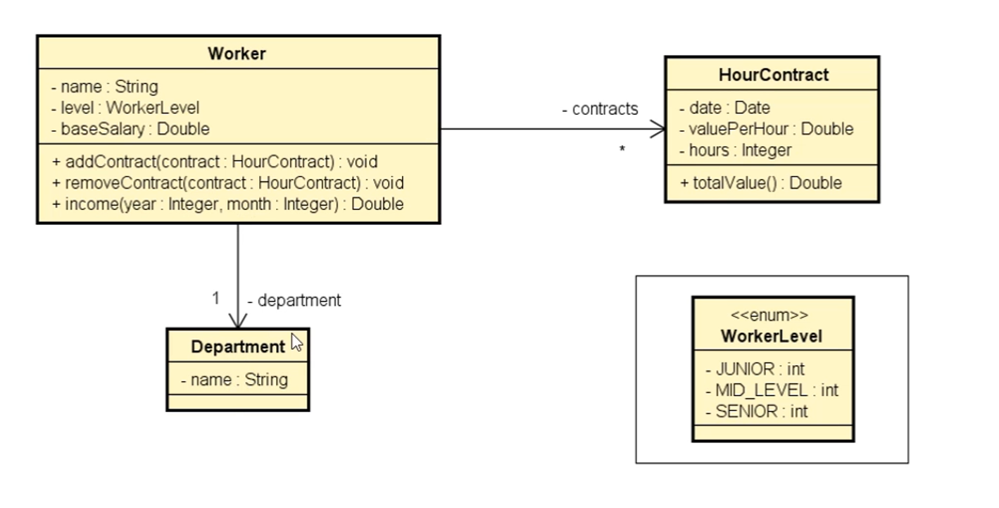
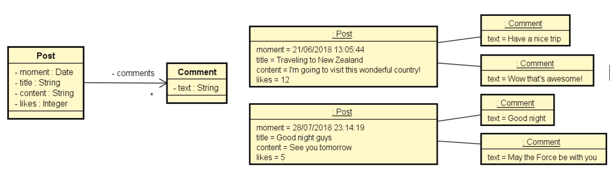
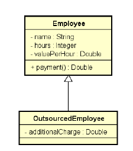
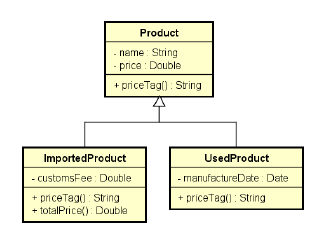
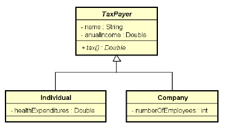
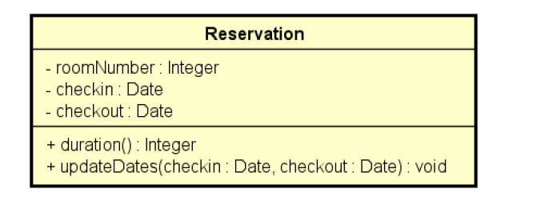
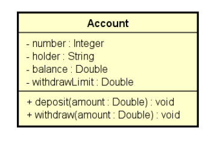

# Udemy-java
Exercicios do curso de Java do professor Nelio Alves

**Program1 - Triangle**
*Entrada a área de 2 triangulos calcula e mostra o com maior área 

**Program2 - Products**
*Entrada de produtos, preço e total do valor em estoque

**Program3 - Rectangle**
*Entrada para área de um retangulo mostra área, perimetro, diagonal

**Program4 - RH**
*Entrada de nome, salario bruto e porcentagem de acrescimo

**Program5 - Student**
*Entrada nome de aluno e 3 grades de notas e analise se passou ou não

**Program6 - CurrencyConverter**
*Conversor de moeda

**Program7 - Bank**
*Inicia uma conta com deposito e taxa sobre saque

**Program8**
*Faça um programa que leia um número inteiro positivo N (máximo = 10) e depois N números inteiros
e armazene-os em um vetor. Em seguida, mostrar na tela todos os números negativos lidos.

**Program9**
*Faça um programa que leia N números reais e armazene-os em um vetor. Em seguida:
- Imprimir todos os elementos do vetor
- Mostrar na tela a soma e a média dos elementos do vetor

**Program10**
*Fazer um programa para ler nome, idade e altura de N pessoas, conforme exemplo. Depois, mostrar na
tela a altura média das pessoas, e mostrar também a porcentagem de pessoas com menos de 16 anos,
bem como os nomes dessas pessoas caso houver.

**Program11**
*Faça um programa que leia N números inteiros e armazene-os em um vetor. Em seguida, mostre na
tela todos os números pares, e também a quantidade de números pares.

**Program12**
*Faça um programa que leia N números reais e armazene-os em um vetor. Em seguida, mostrar na tela
o maior número do vetor (supor não haver empates). Mostrar também a posição do maior elemento,
considerando a primeira posição como 0 (zero).

**Program13
*Faça um programa para ler dois vetores A e B, contendo N elementos cada. Em seguida, gere um
terceiro vetor C onde cada elemento de C é a soma dos elementos correspondentes de A e B. Imprima
o vetor C gerado.

**Program14**
*Fazer um programa para ler um número inteiro N e depois um vetor de N números reais. Em seguida,
mostrar na tela a média aritmética de todos elementos com três casas decimais. Depois mostrar todos
os elementos do vetor que estejam abaixo da média, com uma casa decimal cada.

**Program14**
*Fazer um programa para ler um vetor de N números inteiros. Em seguida, mostrar na tela a média
aritmética somente dos números pares lidos, com uma casa decimal. Se nenhum número par for
digitado, mostrar a mensagem "NENHUM NUMERO PAR"

**Program15**
*Fazer um programa para ler um vetor de N números inteiros. Em seguida, mostrar na tela a média
aritmética somente dos números pares lidos, com uma casa decimal. Se nenhum número par for
digitado, mostrar a mensagem "NENHUM NUMERO PAR"

**Program16 - Pessoa**
*Fazer um programa para ler um conjunto de nomes de pessoas e suas respectivas idades. Os nomes
devem ser armazenados em um vetor, e as idades em um outro vetor. Depois, mostrar na tela o nome
da pessoa mais velha.

**Program17 - Aluno**
*Fazer um programa para ler um conjunto de N nomes de alunos, bem como as notas que eles tiraram
no 1º e 2º semestres. Cada uma dessas informações deve ser armazenada em um vetor. Depois, imprimir
os nomes dos alunos aprovados, considerando aprovados aqueles cuja média das notas seja maior ou
igual a 6.0 (seis).

**Program18**
*Tem-se um conjunto de dados contendo a altura e o gênero (M, F) de N pessoas. Fazer um programa
que calcule e escreva a maior e a menor altura do grupo, a média de altura das mulheres, e o número
de homens.

**Program19 - Regis**
*A dona de um pensionato possui 10 quartos para alugar para estudantes, sendo esses quartos identificados pelos números 0 a 9. Fazer um programa que inicie com todos os dez quartos vazios e depois leia uma quantidade N representando o número de estudantes que vão alugar quartos(N pode ser de 1 a 10). Em seguida, registre o aluguel dos N estudantes. Para cada registro de aluguel ele escolheu (de 0 a 9). Suponha que seja escolhido um quarto vago. Ao final, seu programa deve imprimir um relatorio de todas ocupações do pensionato, por ordem de quarto, conforme exemplo.

**Program20 - Emplyoee**
*Fazer um programa para ler um número inteiro N e depois os dados(id, nome e salario) de N funcionários. Não deve haver repetição de ID. Em seguida, efeturar o aumento de X por cento no salário de um determinado funcionário. Para isso, o programa deve ler um ID e o valor X. Se o ID informado não existir, mostra uma mensagem e abortar a operação. Ao final, mostrar a listagem atualizada dos funcionários, conforme exemplos. Lembre-se de aplicar a técnica de encapsulamento para não permitir que o salário possa ser mudado livremente. Um salário só pode ser aumentado com base em uma operação de aumento por porcentagem dada

**Program21**
*Fazer um programa para ler um número inteiro N e uma matriz de ordem N contendo números inteiros. Em seguida, mostrar a diagonal principal e a quantidade de valores negativos da matriz.

**Program22**
*Fazer um programa para ler dois números inteiros M e N, e depois ler uma matriz de M linhas por N colunas contendo números inteiros, podendo haver repetições. Em seguida, ler um numero inteiro X que pertence à matriz. Para cada ocorrência de X, mostra os valores à esquerda, acima, à direita e abaixo de X, quando houver, conforme exemplo.

**Program23**
• Instanciação
• (agora) ➞ Data-hora
• Texto ISO 8601 ➞ Data-hora
• Texto formato customizado ➞ Data-hora
• dia, mês, ano, [horário] ➞ Data-hora local
• Formatação
• Data-hora ➞ Texto ISO 8601
• Data-hora ➞ Texto formato customizado

**Program24**
Java < 8

**Program25**
Java < 8 - Calendar

**Program26-Worker-HourContract-Department-(*WorkerLevel*)**
*Ler os dados de um trabalhador com N contratos (N fornecido pelo usuário). Depois, solicitar do usuário um mês e mostrar qual foi o salário do funcionário nesse mês, conforme exemplo 

**Program27-Post-Comment**
*Instance manualmente (hard code) os objetos mostrados abaixo e mostre-os na tela do terminal, conforme exemplo

**Program28-Order-Client-OrderItem-Product-(*OrderStatus*)**
*Ler os dados de um pedido com N itens (N fornecido pelo usuário). Depois, mostrar um sumário do pedido conforme exemplo. Nota: o instante do pedido deve ser o instante do sistema: new Date()

**Program29-EmployeeOO-OutsourcedEmployee**
*Uma empresa possui funcionários próprios e terceirizados. Para cada funcionário, deseja-se registrar nome, horas trabalhadas e valor por hora. Funcionários terceirizado possuem ainda uma despesa adicional. O pagamento dos funcionários corresponde ao valor da hora multiplicado pelas horas trabalhadas, sendo que os funcionários terceirizados ainda recebem um bônus correspondente a 110% de sua despesa adicional. Fazer um programa para ler os dados de N funcionários (N fornecido pelo usuário) e armazená-los em uma lista. Depois de ler todos os dados, mostrar nome e pagamento de cada funcionário na mesma ordem em que foram digitados.Construa o programa conforme projeto ao lado. Veja exemplo na próxima página.

**Program30-ProductOO-ImportedProduct-UsedProduct** 
*Fazer um programa para ler os dados de N produtos (N fornecido pelo usuário). Ao final, mostrar a etiqueta de preço de cada produto na mesma ordem em que foram digitados. Todo produto possui nome e preço. Produtos importados possuem uma taxa de alfândega, e produtos usados possuem data de fabricação. Estes dados específicos devem ser acrescentados na etiqueta de preço conforme exemplo (próxima página). Para produtos importados, a taxa e alfândega deve ser acrescentada ao preço final do produto. 

**Program31 - TaxPayer - Individual - Company**
*Fazer um programa para ler os dados de N contribuintes (N fornecido pelo usuário), os quais podem ser pessoa física ou pessoa jurídica, e depois mostrar o valor do imposto pago por cada um, bem como o total de imposto arrecadado.
Os dados de pessoa física são: nome, renda anual e gastos com saúde. Os dados de pessoa jurídica são nome, renda anual e número de funcionários. As regras para cálculo de imposto são as seguintes:
Pessoa física: pessoas cuja renda foi abaixo de 20000.00 pagam 15% de imposto. Pessoas com
renda de 20000.00 em diante pagam 25% de imposto. Se a pessoa teve gastos com saúde, 50%
destes gastos são abatidos no imposto.
Exemplo: uma pessoa cuja renda foi 50000.00 e teve 2000.00 em gastos com saúde, o imposto
fica: (50000 * 25%) - (2000 * 50%) = 11500.00
Pessoa jurídica: pessoas jurídicas pagam 16% de imposto. Porém, se a empresa possuir mais de 10
funcionários, ela paga 14% de imposto.
Exemplo: uma empresa cuja renda foi 400000.00 e possui 25 funcionários, o imposto fica:
400000 * 14% = 56000.00 

**Program32 - Reservation - DomainException**
* Fazer um programa para ler os dados de uma reserva de hotel (número do quarto, data
de entrada e data de saída) e mostrar os dados da reserva, inclusive sua duração em
dias. Em seguida, ler novas datas de entrada e saída, atualizar a reserva, e mostrar
novamente a reserva com os dados atualizados. O programa não deve aceitar dados
inválidos para a reserva, conforme as seguintes regras:
- Alterações de reserva só podem ocorrer para datas futuras
- A data de saída deve ser maior que a data de entrada
 

**Program33 - Account**
Fazer um programa para ler os dados de uma conta bancária e depois realizar um
saque nesta conta bancária, mostrando o novo saldo. Um saque não pode ocorrer
ou se não houver saldo na conta, ou se o valor do saque for superior ao limite de
saque da conta. Implemente a conta bancária conforme projeto abaixo:
 