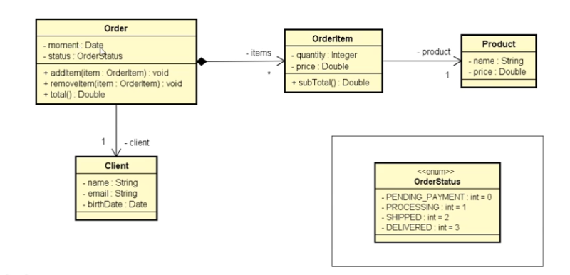

# Udemy-java
Exercicios do curso de Java do professor Nelio Alves

**Program1 - Triangle**
*Entrada a área de 2 triangulos calcula e mostra o com maior área 

**Program2 - Products**
*Entrada de produtos, preço e total do valor em estoque

**Program3 - Rectangle**
*Entrada para área de um retangulo mostra área, perimetro, diagonal

**Program4 - RH**
*Entrada de nome, salario bruto e porcentagem de acrescimo

**Program5 - Student**
*Entrada nome de aluno e 3 grades de notas e analise se passou ou não

**Program6 - CurrencyConverter**
*Conversor de moeda

**Program7 - Bank**
*Inicia uma conta com deposito e taxa sobre saque

**Program8**
*Faça um programa que leia um número inteiro positivo N (máximo = 10) e depois N números inteiros
e armazene-os em um vetor. Em seguida, mostrar na tela todos os números negativos lidos.

**Program9**
*Faça um programa que leia N números reais e armazene-os em um vetor. Em seguida:
- Imprimir todos os elementos do vetor
- Mostrar na tela a soma e a média dos elementos do vetor

**Program10**
*Fazer um programa para ler nome, idade e altura de N pessoas, conforme exemplo. Depois, mostrar na
tela a altura média das pessoas, e mostrar também a porcentagem de pessoas com menos de 16 anos,
bem como os nomes dessas pessoas caso houver.

**Program11**
*Faça um programa que leia N números inteiros e armazene-os em um vetor. Em seguida, mostre na
tela todos os números pares, e também a quantidade de números pares.

**Program12**
*Faça um programa que leia N números reais e armazene-os em um vetor. Em seguida, mostrar na tela
o maior número do vetor (supor não haver empates). Mostrar também a posição do maior elemento,
considerando a primeira posição como 0 (zero).

**Program13
*Faça um programa para ler dois vetores A e B, contendo N elementos cada. Em seguida, gere um
terceiro vetor C onde cada elemento de C é a soma dos elementos correspondentes de A e B. Imprima
o vetor C gerado.

**Program14**
*Fazer um programa para ler um número inteiro N e depois um vetor de N números reais. Em seguida,
mostrar na tela a média aritmética de todos elementos com três casas decimais. Depois mostrar todos
os elementos do vetor que estejam abaixo da média, com uma casa decimal cada.

**Program14**
*Fazer um programa para ler um vetor de N números inteiros. Em seguida, mostrar na tela a média
aritmética somente dos números pares lidos, com uma casa decimal. Se nenhum número par for
digitado, mostrar a mensagem "NENHUM NUMERO PAR"

**Program15**
*Fazer um programa para ler um vetor de N números inteiros. Em seguida, mostrar na tela a média
aritmética somente dos números pares lidos, com uma casa decimal. Se nenhum número par for
digitado, mostrar a mensagem "NENHUM NUMERO PAR"

**Program16 - Pessoa**
*Fazer um programa para ler um conjunto de nomes de pessoas e suas respectivas idades. Os nomes
devem ser armazenados em um vetor, e as idades em um outro vetor. Depois, mostrar na tela o nome
da pessoa mais velha.

**Program17 - Aluno**
*Fazer um programa para ler um conjunto de N nomes de alunos, bem como as notas que eles tiraram
no 1º e 2º semestres. Cada uma dessas informações deve ser armazenada em um vetor. Depois, imprimir
os nomes dos alunos aprovados, considerando aprovados aqueles cuja média das notas seja maior ou
igual a 6.0 (seis).

**Program18**
*Tem-se um conjunto de dados contendo a altura e o gênero (M, F) de N pessoas. Fazer um programa
que calcule e escreva a maior e a menor altura do grupo, a média de altura das mulheres, e o número
de homens.

**Program19 - Regis**
*A dona de um pensionato possui 10 quartos para alugar para estudantes, sendo esses quartos identificados pelos números 0 a 9. Fazer um programa que inicie com todos os dez quartos vazios e depois leia uma quantidade N representando o número de estudantes que vão alugar quartos(N pode ser de 1 a 10). Em seguida, registre o aluguel dos N estudantes. Para cada registro de aluguel ele escolheu (de 0 a 9). Suponha que seja escolhido um quarto vago. Ao final, seu programa deve imprimir um relatorio de todas ocupações do pensionato, por ordem de quarto, conforme exemplo.

**Program20 - Emplyoee**
*Fazer um programa para ler um número inteiro N e depois os dados(id, nome e salario) de N funcionários. Não deve haver repetição de ID. Em seguida, efeturar o aumento de X por cento no salário de um determinado funcionário. Para isso, o programa deve ler um ID e o valor X. Se o ID informado não existir, mostra uma mensagem e abortar a operação. Ao final, mostrar a listagem atualizada dos funcionários, conforme exemplos. Lembre-se de aplicar a técnica de encapsulamento para não permitir que o salário possa ser mudado livremente. Um salário só pode ser aumentado com base em uma operação de aumento por porcentagem dada

**Program21**
*Fazer um programa para ler um número inteiro N e uma matriz de ordem N contendo números inteiros. Em seguida, mostrar a diagonal principal e a quantidade de valores negativos da matriz.

**Program22**
*Fazer um programa para ler dois números inteiros M e N, e depois ler uma matriz de M linhas por N colunas contendo números inteiros, podendo haver repetições. Em seguida, ler um numero inteiro X que pertence à matriz. Para cada ocorrência de X, mostra os valores à esquerda, acima, à direita e abaixo de X, quando houver, conforme exemplo.

**Program23**(Date)
• Instanciação
• (agora) ➞ Data-hora
• Texto ISO 8601 ➞ Data-hora
• Texto formato customizado ➞ Data-hora
• dia, mês, ano, [horário] ➞ Data-hora local
• Formatação
• Data-hora ➞ Texto ISO 8601
• Data-hora ➞ Texto formato customizado

**Program24**
Java < 8

**Program25**
Java < 8 - Calendar

**Program26-Worker-HourContract-Department-(*WorkerLevel*)**
*Ler os dados de um trabalhador com N contratos (N fornecido pelo usuário). Depois, solicitar do usuário um mês e mostrar qual foi o salário do funcionário nesse mês, conforme exemplo 

**Program27-Post-Comment**
*Instance manualmente (hard code) os objetos mostrados abaixo e mostre-os na tela do terminal, conforme exemplo

**Program28-Order-Client-OrderItem-Product-(*OrderStatus*)**
*Ler os dados de um pedido com N itens (N fornecido pelo usuário). Depois, mostrar um sumário do pedido conforme exemplo. Nota: o instante do pedido deve ser o instante do sistema: new Date()

**Program29-EmployeeOO-OutsourcedEmployee**
*Uma empresa possui funcionários próprios e terceirizados. Para cada funcionário, deseja-se registrar nome, horas trabalhadas e valor por hora. Funcionários terceirizado possuem ainda uma despesa adicional. O pagamento dos funcionários corresponde ao valor da hora multiplicado pelas horas trabalhadas, sendo que os funcionários terceirizados ainda recebem um bônus correspondente a 110% de sua despesa adicional. Fazer um programa para ler os dados de N funcionários (N fornecido pelo usuário) e armazená-los em uma lista. Depois de ler todos os dados, mostrar nome e pagamento de cada funcionário na mesma ordem em que foram digitados.Construa o programa conforme projeto ao lado. Veja exemplo na próxima página.

**Program30-ProductOO-ImportedProduct-UsedProduct** 
*Fazer um programa para ler os dados de N produtos (N fornecido pelo usuário). Ao final, mostrar a etiqueta de preço de cada produto na mesma ordem em que foram digitados. Todo produto possui nome e preço. Produtos importados possuem uma taxa de alfândega, e produtos usados possuem data de fabricação. Estes dados específicos devem ser acrescentados na etiqueta de preço conforme exemplo (próxima página). Para produtos importados, a taxa e alfândega deve ser acrescentada ao preço final do produto. 

**Program31 - TaxPayer - Individual - Company**
*Fazer um programa para ler os dados de N contribuintes (N fornecido pelo usuário), os quais podem ser pessoa física ou pessoa jurídica, e depois mostrar o valor do imposto pago por cada um, bem como o total de imposto arrecadado.
Os dados de pessoa física são: nome, renda anual e gastos com saúde. Os dados de pessoa jurídica são nome, renda anual e número de funcionários. As regras para cálculo de imposto são as seguintes:
Pessoa física: pessoas cuja renda foi abaixo de 20000.00 pagam 15% de imposto. Pessoas com
renda de 20000.00 em diante pagam 25% de imposto. Se a pessoa teve gastos com saúde, 50%
destes gastos são abatidos no imposto.
Exemplo: uma pessoa cuja renda foi 50000.00 e teve 2000.00 em gastos com saúde, o imposto
fica: (50000 * 25%) - (2000 * 50%) = 11500.00
Pessoa jurídica: pessoas jurídicas pagam 16% de imposto. Porém, se a empresa possuir mais de 10
funcionários, ela paga 14% de imposto.
Exemplo: uma empresa cuja renda foi 400000.00 e possui 25 funcionários, o imposto fica:
400000 * 14% = 56000.00 

**Program32 - Reservation - DomainException**
* Fazer um programa para ler os dados de uma reserva de hotel (número do quarto, data
de entrada e data de saída) e mostrar os dados da reserva, inclusive sua duração em
dias. Em seguida, ler novas datas de entrada e saída, atualizar a reserva, e mostrar
novamente a reserva com os dados atualizados. O programa não deve aceitar dados
inválidos para a reserva, conforme as seguintes regras:
- Alterações de reserva só podem ocorrer para datas futuras
- A data de saída deve ser maior que a data de entrada
 

**Program33 - Account**
Fazer um programa para ler os dados de uma conta bancária e depois realizar um
saque nesta conta bancária, mostrando o novo saldo. Um saque não pode ocorrer
ou se não houver saldo na conta, ou se o valor do saque for superior ao limite de
saque da conta. Implemente a conta bancária conforme projeto abaixo:
 

**Program34**
*Reader - Bloco try-with-resources
É um bloco try que declara um ou mais recursos, e garante que esses
recursos serão fechados ao final do bloco
 
 **Program35**
 *Writer - FileWriter (stream de escrita de caracteres em de arquivos)
 • Cria/recria o arquivo: new FileWriter(path)
• Acrescenta ao arquivo existente: new FileWriter(path, true)
BufferedWriter (mais rápido)

**Program36**
*Manipulação de pastas

**Program37**
*Informações de arquivos

**Program38-ProductReader**
Fazer um programa para ler o caminho de um arquivo .csv contendo os dados de itens vendidos. Cada item possui um
nome, preço unitário e quantidade, separados por vírgula. Você deve gerar um novo arquivo chamado "summary.csv", localizado
em uma subpasta chamada "out" a partir da pasta original do arquivo de origem, contendo apenas o nome e o valor total para
aquele item (preço unitário multiplicado pela quantidade),conforme exemplo.

**Program39 - Entities: Vehicle- CarRental-Invoice / Services: BrazilianTaxService - RentalService**
Uma locadora brasileira de carros cobra um valor por hora para locações de até 12 horas. Porém, se a duração da locação ultrapassar 12 horas, a locação será cobrada com base em um valor diário. Além do valor da locação, é acrescido no
preço o valor do imposto conforme regras do país que, no caso do Brasil, é 20% para valores até 100.00, ou 15% para valores acima de 100.00. Fazer um programa que lê os dados da locação (modelo do carro, instante inicial e final da
locação), bem como o valor por hora e o valor diário de locação. O programa deve então gerar a nota de pagamento (contendo valor da locação, valor doimposto e valor total do pagamento) e informar os dados na tela. Veja os exemplos.

**Program40 - Entitis: Contract - Installment Services: ContractService- OnlinePaymentService-PaypalService**
*Uma empresa deseja automatizar o processamento de seus contratos. O processamento de um contrato consiste em gerar as parcelas a serem pagas para aquele contrato, com base no número de meses desejado. A empresa utiliza um serviço de pagamento online para realizar o pagamento das parcelas. Os serviços de pagamento online tipicamente cobram um juro mensal, bem como uma taxa por pagamento. Por enquanto, o serviço contratado pela empresa é o do Paypal, que aplica
juros simples de 1% a cada parcela, mais uma taxa de pagamento de 2%. Fazer um programa para ler os dados de um contrato (número do contrato, data do contrato, e valor total do contrato). Em seguida, o programa deve ler o número de meses para
parcelamento do contrato, e daí gerar os registros de parcelas a serem pagas (data e valor), sendo a primeira parcela a ser paga um mês após a data do contrato, a segunda parcela dois meses após o contrato e assim por diante. Mostrar os dados das parcelas na tela. Veja exemplo na próxima página.

**Program41** (Comparable)
*Faça um programa para ler um arquivo contendo nomes de pessoas (um nome por
linha), armazenando-os em uma lista. Depois, ordenar os dados dessa lista e mostra-los
ordenadamente na tela. Nota: o caminho do arquivo pode ser informado "hardcode".
Maria Brown
Alex Green
Bob Grey
Anna White
Alex Black
Eduardo Rose
Willian Red
Marta Blue
Alex Brown

**Prgram42 - Funcionario**
*Faça um programa para ler um arquivo contendo funcionários (nome e salário) no
formato .csv, armazenando-os em uma lista. Depois, ordenar a lista por nome e mostrar
o resultado na tela. Nota: o caminho do arquivo pode ser informado "hardcode".
Maria Brown,4300.00
Alex Green,3100.00
Bob Grey,3100.00
Anna White,3500.00
Alex Black,2450.00
Eduardo Rose,4390.00
Willian Red,2900.00
Marta Blue,6100.00
Alex Brown,5000.00

**Program43- BrazilianInterestService-UsaInterestService Inter:InterestService**(Default methods (defender methods))
*Fazer um programa para ler uma quantia e a duração em meses de um
empréstimo. Informar o valor a ser pago depois de decorrido o prazo do
empréstimo, conforme regras de juros do Brasil. A regra de cálculo de
juros do Brasil é juro composto padrão de 2% ao mês.

**Program44**(Coringa Delimitado)

**Program44-PrintService**(Generics)
*Deseja-se fazer um programa que leia uma quantidade N, e depois N números
inteiros. Ao final, imprima esses números de forma organizada conforme
exemplo. Em seguida, informar qual foi o primeiro valor informado.

**Program45- entities: Prod - Service:CalculationService** (Generics delimitados)
*Uma empresa de consultoria deseja avaliar a performance de produtos,
funcionários, dentre outras coisas. Um dos cálculos que ela precisa é encontrar
o maior dentre um conjunto de elementos. Fazer um programa que leia um
conjunto de produtos a partir de um arquivo, conforme exemplo, e depois
mostre o mais caro deles.
Computer,890.50
IPhone X,910.00
Tablet,550.00

**Program45**(Generics Delimitado)

**Program46**(Curinga-wildcard types)

**Program47** (Curingas delimitados-bounded wildcards)

**Program48 - ClientHash** (HashCode equals)

**Program49-ProductSet** (Set)

**Program50**

**Program51-Users**
*Um site de internet registra um log de acessos dos usuários. Um
registro de log consiste no nome de usuário (apenas uma palavra) e o
instante em que o usuário acessou o site no padrão ISO 8601,
separados por espaço, conforme exemplo. Fazer um programa que leia
o log de acessos a partir de um arquivo, e daí informe quantos usuários
distintos acessaram o site.

**Program52**
*Em um portal de cursos online, cada usuário possui um código único, representado por
um número inteiro.
Cada instrutor do portal pode ter vários cursos, sendo que um mesmo aluno pode se
matricular em quantos cursos quiser. Assim, o número total de alunos de um instrutor não
é simplesmente a soma dos alunos de todos os cursos que ele possui, pois pode haver
alunos repetidos em mais de um curso.
O instrutor Alex possui três cursos A, B e C, e deseja saber seu número total de alunos.
Seu programa deve ler os alunos dos cursos A, B e C do instrutor Alex, depois mostrar a
quantidade total e alunos dele, conforme exemplo.

**Program53**(Map)

**Program54- ProductMap**

**Program55**
*Na contagem de votos de uma eleição, são gerados vários registros
de votação contendo o nome do candidato e a quantidade de votos
(formato .csv) que ele obteve em uma urna de votação. Você deve
fazer um programa para ler os registros de votação a partir de um
arquivo, e daí gerar um relatório consolidado com os totais de cada
candidato.

**Program56- productComp-MyComparator**(Comparator/Lambda)

 (OROGRAMAÇÃO FUNCIONAL)
 
 **Program57**(Transparencia referencial)
 
 **Program58** (Funções de primeira ordem)
 
 **Program59** (Expressividade)
 
 **Program60** (Tipagem Dinamica)
 
 **Program61- ProductPredicate** (Predicate)
 
 **Program62- PriceUpdate**(Consumer)